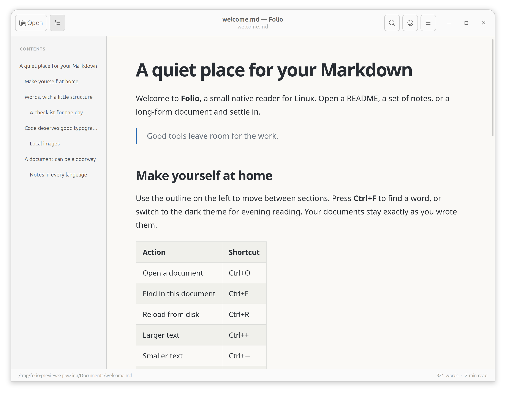

# Folio

A quiet, native Linux reader for Markdown. Open a document, follow its outline, search its text, and read in a light or dark theme. Everything runs locally, and reading never modifies your files.



Folio supports tables, task lists, fenced code, local images, adjustable text size, and automatic reload when your editor saves. GTK provides the desktop interface; WebKitGTK typesets the document. [See the dark theme](docs/images/folio-dark.png).

## Install

Download **`folio-0.1.1-x86_64.flatpak`** from [GitHub Releases](https://github.com/romitdasgupta/mdreader/releases/latest). The binary release supports **x86-64 Linux desktops with Flatpak**. It installs Folio and the shared runtime containing Python, GTK and WebKitGTK; no separate Python setup is needed.

If you need Flatpak, follow [the setup instructions for your distribution](https://flatpak.org/setup/). On Ubuntu, run `sudo apt install flatpak`. Log out and back in after first setting up Flatpak so desktop launchers appear.

From the directory containing the download:

```sh
flatpak install --user ./folio-0.1.1-x86_64.flatpak
flatpak run io.github.romitdasgupta.mdreader
```

Accept the runtime installation when prompted. The first install needs internet access and may download several hundred megabytes. Other Flatpak applications can reuse the same runtime.

Launch **Folio** from your application menu, choose it in your file manager's **Open With** menu, or open a document from a terminal:

```sh
flatpak run io.github.romitdasgupta.mdreader /absolute/path/to/document.md
```

Folio does not change your default file associations. This release is distributed directly through GitHub; it is not listed on Flathub.

### Updates and uninstall

To update Folio, download the new release bundle and install it with `flatpak install --user ./<new-bundle>.flatpak`. This channel does not provide automatic application updates. Keep the shared runtime updated with:

```sh
flatpak update --user
```

Uninstall with:

```sh
flatpak uninstall --user io.github.romitdasgupta.mdreader
```

Documents and preferences are preserved unless you explicitly request deletion of application data. Each release includes a `.sha256` file for optional download verification with `sha256sum -c <filename>.sha256`.

## Reading

Use **Open**, press **Ctrl+O**, or drop a Markdown file into the window. The header controls toggle the outline and theme.

| Action | Shortcut |
| --- | --- |
| Open a file | Ctrl+O |
| Find text | Ctrl+F |
| Next / previous result | Enter / Shift+Enter in search |
| Dismiss search | Escape |
| Toggle the outline | F9 |
| Reload | Ctrl+R |
| Increase / decrease text size | Ctrl++ / Ctrl+− |
| Reset text size | Ctrl+0 |

Local Markdown links open in Folio. Web and email links open in the desktop's default handler when clicked. Automatic reload handles ordinary and atomic saves; a failed open or reload leaves the current document available.

### Files and privacy

Documents must be UTF-8, with or without a BOM, and no larger than 10 MiB. Supported local images are embedded from the document's directory tree; images outside it are unavailable. Raw HTML is displayed as text, document scripts do not run, and remote images are blocked.

The Flatpak has read-only access to host files so nearby images, relative links and reload work. Flatpak still hides some reserved paths. The application has no network permission, accounts, telemetry, editor, or server.

The Flatpak disables WebKitGTK's DMA-BUF renderer for compatibility with a known
Wayland protocol failure in some graphics-driver/runtime combinations. This keeps
documents open reliably; systems affected by that renderer issue may use a less
GPU-accelerated WebKit path.

Flatpak preferences are stored in `~/.var/app/io.github.romitdasgupta.mdreader/config/folio/`. Source installations use `$XDG_CONFIG_HOME/folio` or `~/.config/folio`.

## Run from source

The Flatpak is the recommended installation for readers. Source and wheel installations require native dependencies supplied by your distribution.

### Dependencies on a fresh system

Folio requires Python 3.11+, PyGObject, GTK 3, WebKitGTK 4.1, and markdown-it-py 3.x or 4.x. On Ubuntu 24.04 or newer:

```sh
sudo apt install git python3 python3-gi python3-gi-cairo gir1.2-gtk-3.0 gir1.2-webkit2-4.1 python3-markdown-it

git clone https://github.com/romitdasgupta/mdreader.git
cd mdreader
/usr/bin/python3 -m folio examples/welcome.md
```

Run without a file argument for an empty window. A graphical Linux session is required. Use the distribution's `/usr/bin/python3` so it can find the native GTK bindings. Installing the Python package alone does not install GTK or WebKitGTK.

For development, retain access to those system bindings:

```sh
sudo apt install python3-venv
/usr/bin/python3 -m venv --system-site-packages .venv
.venv/bin/python -m pip install -e '.[dev]'
.venv/bin/folio examples/welcome.md
```

### Optional source desktop integration

After installing the source dependencies, copy the app, icon and launcher into `~/.local`:

```sh
/usr/bin/python3 scripts/install_local.py
```

Launch **Folio** from your menu or run `~/.local/bin/folio file.md`. Rerun the installer after updating your checkout. Remove this source installation with `/usr/bin/python3 scripts/install_local.py --uninstall`; preferences are preserved. This installer does not install dependencies or change default file associations.

## Development and contributing

Bug reports and focused pull requests are welcome through [GitHub Issues](https://github.com/romitdasgupta/mdreader/issues) and pull requests. Include reproduction steps, your distribution, installation method, and relevant error output. Please use a minimal example document without private content.

Start with [AGENTS.md](AGENTS.md) for the module map, boundaries and verification requirements; it applies to human and agent-assisted changes. The [architecture](docs/ARCHITECTURE.md) and [product scope](docs/PRODUCT.md) explain the design. The parser and preferences run without GTK or a display.

After the development setup above:

```sh
.venv/bin/python -m pytest -q
.venv/bin/python scripts/smoke_gui.py
.venv/bin/python -m build --no-isolation
```

GUI checks need a display or Xvfb. Exit 2 means the GUI environment is unavailable, not a passing check. The development venv supplies the build frontend; system Python may have GTK without `build`.

### Package verification

Build the source archive and wheel, install into a disposable environment, and verify outside the checkout:

```sh
.venv/bin/python scripts/verify_package.py --gui
```

Omit `--gui` for headless package checks. Screenshots and the GUI report are written under `artifacts/package/`. The smoke runner normally tests the checkout; `--installed` verifies the installed distribution and rejects editable/source imports. Test the local installer only with a disposable `--prefix`.

See [distribution and release instructions](docs/DISTRIBUTION.md) for Flatpak builds, [GUI verification](docs/GUI_TEST_REPORT.md) for the test procedure, [acceptance criteria](docs/ACCEPTANCE.md) for manual checks, and [release verification](docs/RELEASE.md) for the tested environment and remaining limits. CI builds the Flatpak and runs its installed GUI checks on pushes and pull requests.

## License and development

Folio is [MIT licensed](LICENSE). Its implementation, documentation and packaging were developed with AI assistance and verified through automated tests, real GUI checks and code review.
